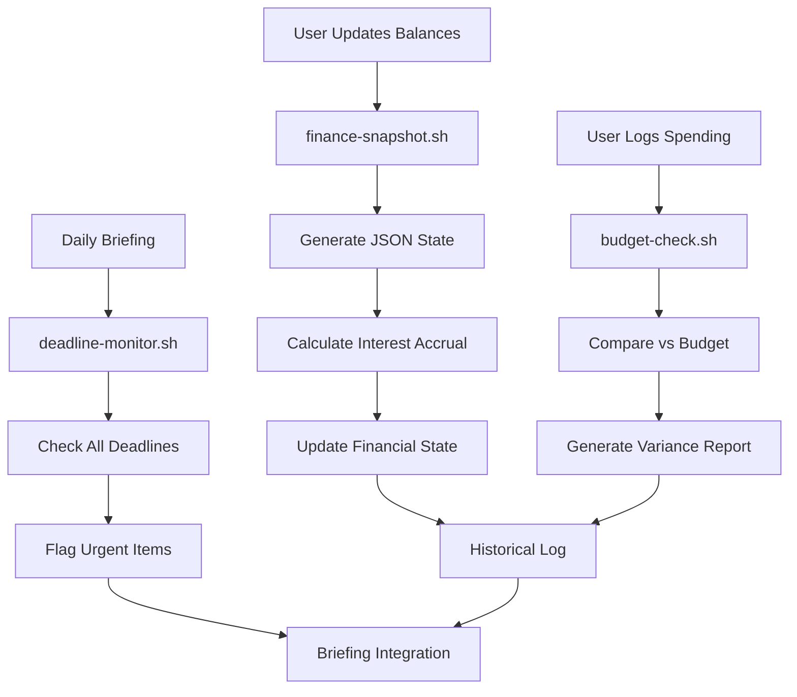

# Financial Tracker Skill

> **JSON-based financial state tracking with automated calculations, budget monitoring, and deadline alerts**

## Purpose

This skill provides structured, machine-readable financial tracking to replace manual calculations and estimates in daily briefings. It generates consistent JSON snapshots of debt balances, calculates interest accrual, compares budget vs actual spending, and monitors critical deadlines.

## Problem Solved

**Before this skill:**
- Manual interest calculations repeated in every briefing (token waste)
- Estimated balance ranges ($8,400-8,900) due to no real-time data
- No historical tracking of actual vs projected debt reduction
- Manual deadline tracking (promo expirations, payment due dates)
- Inconsistent data across Financial Command Center vs Briefings
- Budget estimates with wide ranges, no actual vs planned comparison

**With this skill:**
- Automated interest calculations (daily, weekly, monthly, annual)
- Single-source-of-truth JSON state file
- Historical tracking for prediction accuracy measurement
- Automated deadline monitoring with configurable alert windows
- Consistent data format across all financial operations
- Budget variance tracking (actual vs planned by category)

## Workflow



## Components

### 1. Finance Snapshot (`scripts/finance-snapshot.sh`)

**Purpose:** Generate current financial state as JSON with all calculated fields.

**Usage:**
```bash
./scripts/finance-snapshot.sh [--update-balance CARD AMOUNT] [--add-payment CARD AMOUNT]
```

**Output:** JSON file at `data/financial-state.json` with:
- Current balances for all debt accounts
- APR for each account
- Calculated daily/weekly/monthly/annual interest
- Last update timestamp
- Payment history
- Projected payoff dates

**Example:**
```bash
# Update Discover balance
./scripts/finance-snapshot.sh --update-balance discover 8250.00

# Record a payment
./scripts/finance-snapshot.sh --add-payment discover 200.00
```

### 2. Budget Check (`scripts/budget-check.sh`)

**Purpose:** Compare actual spending vs budget by category.

**Usage:**
```bash
./scripts/budget-check.sh [--category CATEGORY] [--period week|month]
```

**Output:** JSON variance report showing:
- Budget amount by category
- Actual spent to date
- Variance (over/under budget)
- Percentage of budget used
- Alerts for overspending categories

**Example:**
```bash
# Check weekly groceries budget
./scripts/budget-check.sh --category groceries --period week

# Check all categories monthly
./scripts/budget-check.sh --period month
```

### 3. Deadline Monitor (`scripts/deadline-monitor.sh`)

**Purpose:** Track and alert on upcoming financial deadlines.

**Usage:**
```bash
./scripts/deadline-monitor.sh [--alert-days DAYS]
```

**Output:** JSON report of deadlines within alert window:
- Payment due dates (credit cards, loans)
- Promotional rate expirations
- Tax filing deadlines
- Subscription renewals
- Bill due dates

**Example:**
```bash
# Show deadlines within 7 days
./scripts/deadline-monitor.sh --alert-days 7

# Show only critical (3 days)
./scripts/deadline-monitor.sh --alert-days 3
```

## Data Structure

### Financial State (`data/financial-state.json`)

```json
{
  "last_updated": "2026-03-17T08:15:00Z",
  "total_debt": 33667.00,
  "total_daily_interest": 15.20,
  "accounts": {
    "discover": {
      "type": "credit_card",
      "balance": 8250.00,
      "apr": 27.24,
      "daily_interest": 6.16,
      "weekly_interest": 43.12,
      "monthly_interest": 187.28,
      "annual_interest": 2247.36,
      "minimum_payment": 167.00,
      "due_date": "2026-04-05",
      "status": "active"
    },
    "wells_fargo_1": {
      "type": "credit_card",
      "balance": 11565.00,
      "apr": 0.00,
      "promo_expires": "2026-04-03",
      "post_promo_apr": 20.00,
      "daily_interest": 0.00,
      "post_promo_daily_interest": 6.34,
      "minimum_payment": 125.00,
      "due_date": "2026-03-28",
      "status": "promotional"
    }
  },
  "history": [
    {
      "date": "2026-03-16",
      "action": "payment",
      "account": "discover",
      "amount": 200.00,
      "balance_after": 8450.00
    }
  ]
}
```

### Budget State (`data/budget-state.json`)

```json
{
  "period": "2026-03-16_to_2026-03-22",
  "period_type": "week",
  "categories": {
    "groceries": {
      "budgeted": 200.00,
      "spent": 87.43,
      "remaining": 112.57,
      "percentage_used": 43.72,
      "status": "on_track",
      "transactions": [
        {"date": "2026-03-16", "amount": 45.23, "description": "Walmart"},
        {"date": "2026-03-17", "amount": 42.20, "description": "Publix"}
      ]
    },
    "debt_payments": {
      "budgeted": 1400.00,
      "spent": 600.00,
      "remaining": 800.00,
      "percentage_used": 42.86,
      "status": "on_track"
    }
  },
  "totals": {
    "total_budgeted": 2544.00,
    "total_spent": 1087.43,
    "total_remaining": 1456.57,
    "percentage_used": 42.76
  }
}
```

### Deadline State (`data/deadlines.json`)

```json
{
  "check_date": "2026-03-17",
  "alert_window_days": 7,
  "urgent": [
    {
      "type": "promo_expiration",
      "account": "wells_fargo_1",
      "deadline": "2026-04-03",
      "days_remaining": 17,
      "severity": "high",
      "impact": "Balance $11,565 will incur 20% APR ($6.34/day interest)"
    }
  ],
  "upcoming": [
    {
      "type": "payment_due",
      "account": "discover",
      "deadline": "2026-04-05",
      "days_remaining": 19,
      "severity": "medium",
      "minimum_payment": 167.00
    }
  ],
  "major_deadlines": [
    {
      "type": "tax_filing",
      "deadline": "2026-04-15",
      "days_remaining": 29,
      "severity": "critical",
      "description": "Federal and state tax returns due"
    }
  ]
}
```

## Integration with Briefings

### Before (Manual Calculation)
```markdown
**Discover Card:**
- Balance: $8,400-8,900 (estimated)
- APR: 27.24%
- Daily Interest: $6.28-6.65/day (manually calculated)
- Monthly Interest: $191-202/month (manually calculated)
```

### After (JSON-Driven)
```bash
DISCOVER=$(jq -r '.accounts.discover' data/financial-state.json)
```

```markdown
**Discover Card:**
- Balance: $8,250.00 (last updated: 2026-03-17 08:15 AM)
- APR: 27.24%
- Daily Interest: $6.16/day
- Monthly Interest: $187.28/month
- Annual Interest: $2,247.36/year
```

## Example Outputs

### Finance Snapshot Output
```bash
$ ./scripts/finance-snapshot.sh

Financial State Updated: 2026-03-17 08:15:00

TOTAL DEBT: $33,667.00
TOTAL DAILY INTEREST: $15.20/day ($461/month, $5,548/year)

ACTIVE ACCOUNTS (4):
  ✓ discover        : $8,250.00 @ 27.24% ($6.16/day)
  ⏰ wells_fargo_1  : $11,565.00 @ 0% (promo ends 17 days)
  ✓ wells_fargo_2   : $9,830.00 @ 26.24% ($7.07/day)
  ✓ amazon_synchrony: $1,800.00 @ 24.49% ($1.21/day)

ELIMINATED ACCOUNTS (3):
  ✅ amex           : $0.00 (paid 2026-03-05)
  ✅ auto_loan      : $0.00 (paid 2026-03-05)
  ✅ chase_personal : $0.00 (paid 2026-03-12)

Data written to: data/financial-state.json
```

### Budget Check Output
```bash
$ ./scripts/budget-check.sh --period week

Budget Report: Week of 2026-03-16

CATEGORY         BUDGET    SPENT   REMAINING   % USED  STATUS
─────────────────────────────────────────────────────────────
Groceries        $200.00   $87.43   $112.57     43.7%  ✓ On Track
Gas              $75.00    $52.00   $23.00      69.3%  ⚠ Watch
Debt Payments    $1400.00  $600.00  $800.00     42.9%  ✓ On Track
Subscriptions    $120.00   $120.00  $0.00       100.0% ✓ Paid
─────────────────────────────────────────────────────────────
TOTAL            $2544.00  $1087.43 $1456.57    42.8%  ✓ On Track

⚠ WARNING: Gas spending at 69.3% with 5 days remaining in period
✓ Overall spending pace is healthy
```

### Deadline Monitor Output
```bash
$ ./scripts/deadline-monitor.sh --alert-days 30

Deadline Monitor: 2026-03-17

🔴 CRITICAL (0-7 days):
  None

🟡 URGENT (8-17 days):
  ⏰ Wells Fargo #1 Promo Expires: 17 days (2026-04-03)
     Impact: $11,565 balance → $6.34/day interest

🟢 UPCOMING (18-30 days):
  📅 Discover Payment Due: 19 days (2026-04-05) - Min: $167
  📅 Wells Fargo #2 Payment Due: 25 days (2026-04-11) - Min: $250
  📋 Tax Filing Deadline: 29 days (2026-04-15) - CRITICAL

All deadlines saved to: data/deadlines.json
```

## Usage in Daily Briefings

### Morning Routine
```bash
# 1. Update balances (if user provides actual numbers)
./scripts/finance-snapshot.sh --update-balance discover 8250.00
./scripts/finance-snapshot.sh --update-balance wells_fargo_1 11565.00

# 2. Record payments made
./scripts/finance-snapshot.sh --add-payment discover 200.00

# 3. Check budget status
./scripts/budget-check.sh --period week > /tmp/budget-status.txt

# 4. Check deadlines
./scripts/deadline-monitor.sh --alert-days 7 > /tmp/deadlines.txt

# 5. Generate briefing using JSON data
# Read JSON state and populate briefing template
```

### In Briefing Generation
```bash
# Extract data from JSON for briefing sections
TOTAL_DEBT=$(jq -r '.total_debt' data/financial-state.json)
DAILY_INTEREST=$(jq -r '.total_daily_interest' data/financial-state.json)
DISCOVER_BALANCE=$(jq -r '.accounts.discover.balance' data/financial-state.json)
DISCOVER_DAILY=$(jq -r '.accounts.discover.daily_interest' data/financial-state.json)

# Use in briefing markdown
echo "**Total Debt:** \$$TOTAL_DEBT"
echo "**Daily Interest Burn:** \$$DAILY_INTEREST/day"
```

## Configuration

### Config File (`config/accounts.conf`)

```bash
# Credit Card Accounts
ACCOUNT_DISCOVER_TYPE="credit_card"
ACCOUNT_DISCOVER_APR=27.24

ACCOUNT_WELLS_FARGO_1_TYPE="credit_card"
ACCOUNT_WELLS_FARGO_1_APR=0.00
ACCOUNT_WELLS_FARGO_1_PROMO_EXPIRES="2026-04-03"
ACCOUNT_WELLS_FARGO_1_POST_PROMO_APR=20.00

# Budget Categories (weekly)
BUDGET_GROCERIES_WEEKLY=200.00
BUDGET_GAS_WEEKLY=75.00
BUDGET_DEBT_PAYMENTS_WEEKLY=1400.00
```

### Spending Categories (`references/CATEGORIES.md`)

See `references/CATEGORIES.md` for full category definitions and budgeting guidelines.

## Benefits

1. **Consistency**: Single source of truth for all financial data
2. **Automation**: Pre-calculated interest eliminates repeated math
3. **Accuracy**: Exact balances replace estimated ranges
4. **Historical Tracking**: Log every balance change and payment
5. **Prediction Measurement**: Compare projected vs actual debt reduction
6. **Budget Accountability**: Real-time variance tracking by category
7. **Deadline Safety**: Automated alerts prevent missed payments
8. **Token Efficiency**: JSON data replaces verbose manual calculations
9. **Integration Ready**: Easy to read from scripts, briefings, dashboards
10. **Scalability**: Add new accounts/categories with minimal changes

## Maintenance

### Daily
- Update balances when verified (via user input or manual login)
- Record all payments made
- Log spending transactions by category
- Run deadline monitor in morning briefing

### Weekly
- Generate weekly budget variance report
- Review historical payment log for accuracy
- Update budget allocations if needed
- Archive old JSON snapshots

### Monthly
- Reconcile against actual bank/credit card statements
- Adjust APR values if rates changed
- Update minimum payments if changed
- Review prediction accuracy (projected vs actual)

## Future Enhancements

- [ ] Bank API integration (Plaid, Yodlee) for auto-balance updates
- [ ] Investment tracking (stocks, crypto, 401k, HSA)
- [ ] Payoff date predictions with multiple scenarios
- [ ] Debt avalanche optimizer (algorithmic payment allocation)
- [ ] Spending pattern analysis (ML-based anomaly detection)
- [ ] Bill due date calendar generation (iCal export)
- [ ] Tax document checklist tracking
- [ ] Net worth calculation and trending
- [ ] Emergency fund goal tracking
- [ ] Visual dashboards (HTML/CSS reports)

## License

MIT License - Use freely, modify as needed

## Support

For issues or enhancements, contact the finance-briefing-agent or submit to the knight's table.

---

**Version:** 1.0.0  
**Last Updated:** 2026-03-17  
**Status:** Production Ready
